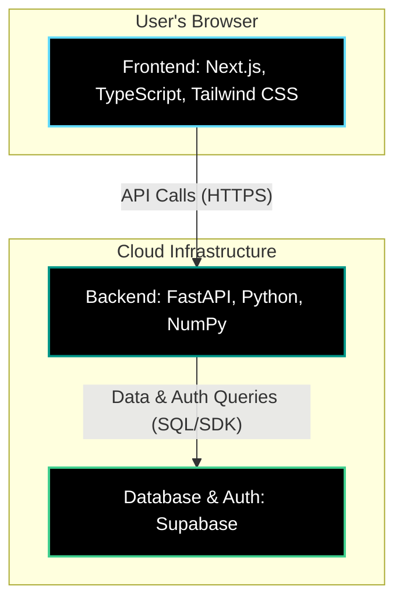

# Net Worth Optimizer

A web application that helps college students make mathematically optimal financial decisions: should they pay off debt or invest their spare cash?

## The Problem

Students often face the dilemma: "I have $100 extra this month. Should I pay down my student loan or invest it?"

This app solves that by comparing:
- **Scenario A**: Paying extra toward debt (guaranteed return = loan interest saved)
- **Scenario B**: Investing in the market (expected return = 10% annually - S&P 500 historical average)

## Features

- **Debt-Aware Investing**: Compares loan interest rates vs. market returns
- **Specific Investment Recommendations**: Get exact ETF allocations with ticker symbols (VOO, VXUS, BND)
- **Risk-Adjusted Portfolios**: Automatic strategy adjustment based on time until graduation
- **Visual Projections**: See your net worth trajectory over time for both strategies
- **How-to-Invest Guide**: Step-by-step instructions for executing the investment plan
- **Clear Recommendations**: Get a definitive answer with confidence scoring
- **College-Optimized**: Designed for 4-year graduation timelines

## Tech Stack

### Backend
- **FastAPI**: Python web framework for the API
- **NumPy**: Financial calculations and optimization engine
- **Pydantic**: Data validation
- **Supabase**: PostgreSQL database and authentication

### Frontend
- **Next.js 14**: React framework with App Router
- **TypeScript**: Type-safe development
- **Tailwind CSS**: Modern, dark-mode UI
- **Chart.js**: Interactive data visualizations
- **Supabase JS Client**: Authentication and real-time database access

## Architecture

Here's a high-level overview of the application's architecture:



## Getting Started

### Prerequisites

- Python 3.9+ (for backend)
- Node.js 18+ (for frontend)
- npm or yarn

### Installation

#### 1. Clone the repository

```bash
cd net-worth-optimizer
```

#### 2. Set up the Backend

```bash
cd backend

# Create a virtual environment
python -m venv venv

# Activate virtual environment
# On macOS/Linux:
source venv/bin/activate
# On Windows:
# venv\Scripts\activate

# Install dependencies
pip install -r requirements.txt

# Run the FastAPI server
uvicorn app.main:app --reload
```

The backend will start at `http://localhost:8000`

To verify it's running, visit `http://localhost:8000` in your browser.

#### 3. Set up the Frontend

Open a **new terminal window** (keep the backend running), then:

```bash
cd frontend

# Install dependencies
npm install

# Run the development server
npm run dev
```

The frontend will start at `http://localhost:3000`

## User Accounts & Authentication

FratFinance now includes **secure user authentication** powered by Supabase. Users can create accounts, sign in securely, and manage their financial plans.

### Authentication Features

- **Sign Up**: Create account with email and password
- **Sign In**: Secure login with encrypted sessions
- **Protected Pages**: Dashboard, Settings, and financial data only accessible to authenticated users
- **Profile Management**: Update full name and password
- **Session Persistence**: Stay logged in across page refreshes
- **Security**: Industry-standard JWT tokens and RLS database policies

### Getting Started with Authentication

#### 1. Set Up Supabase

Before running the app, create a Supabase project:

1. Go to [https://supabase.com](https://supabase.com)
2. Create a new project and note the Project URL and Anon Key
3. Enable "Email Auth" in Authentication > Providers

#### 2. Configure Environment Variables

**Backend** (`backend/.env`):
```
SUPABASE_URL=https://[your-project].supabase.co
SUPABASE_SERVICE_ROLE_KEY=[your-service-role-key]
```

**Frontend** (`frontend/.env.local`):
```
NEXT_PUBLIC_SUPABASE_URL=https://[your-project].supabase.co
NEXT_PUBLIC_SUPABASE_ANON_KEY=[your-anon-key]
```

#### 3. Test Authentication

Once running, test the authentication flow:

1. Go to `http://localhost:3000/auth/signup`
2. Create an account (or skip email verification in dev)
3. Sign in with your credentials
4. Access protected pages like Dashboard and Settings
5. See the comprehensive testing guide: `docs/AUTHENTICATION-TESTING-GUIDE.md`

### Authentication Documentation

- **[AUTHENTICATION-TESTING-GUIDE.md](docs/AUTHENTICATION-TESTING-GUIDE.md)** - Complete testing procedures for all auth flows (10 test scenarios with expected results)
- **[AUTHENTICATION-IMPLEMENTATION-SUMMARY.md](docs/AUTHENTICATION-IMPLEMENTATION-SUMMARY.md)** - Technical architecture, file descriptions, and security features

### Usage

#### First Time Users

1. Go to `http://localhost:3000/auth/signup`
2. Create your account with email and password
3. Verify your email (or skip in development)
4. Sign in with your credentials

#### Using the App

1. After logging in, you're on the Dashboard
2. Use the Calculator to analyze your debt vs. investing scenarios:
   - Principal amount
   - Interest rate
   - Minimum monthly payment
   - Monthly spare cash
   - Months until graduation
3. Get your personalized recommendation with projected outcomes
4. Save your financial plans (only available to logged-in users)
5. Update your profile in Settings

## Example Scenarios

### Scenario 1: High-Interest Loan (9%)
- **Loan**: $25,000 at 9% interest
- **Spare Cash**: $100/month
- **Result**: ✅ Pay Debt (guaranteed 9% return beats market's 7%)

### Scenario 2: Low-Interest Loan (3%)
- **Loan**: $25,000 at 3% interest
- **Spare Cash**: $100/month
- **Result**: ✅ Invest (market's 7% beats loan's 3%)

## Project Structure

```
net-worth-optimizer/
├── backend/
│   ├── app/
│   │   ├── main.py              # FastAPI application
│   │   ├── models/
│   │   │   └── schemas.py       # Pydantic models
│   │   └── services/
│   │       └── optimization_engine.py  # Core calculation logic
│   └── requirements.txt
├── frontend/
│   ├── app/
│   │   ├── page.tsx             # Main dashboard
│   │   ├── layout.tsx           # Root layout
│   │   └── globals.css          # Global styles
│   ├── components/
│   │   ├── InputForm.tsx        # User input form
│   │   ├── RecommendationCard.tsx
│   │   └── ResultsVisualization.tsx
│   ├── lib/
│   │   └── api.ts               # API client
│   └── types/
│       └── index.ts             # TypeScript types
└── README.md
```

## API Documentation

Once the backend is running, visit `http://localhost:8000/docs` for interactive API documentation (Swagger UI).

### Main Endpoint

**POST** `/api/optimize`

Request body:
```json
{
  "loan": {
    "principal": 25000,
    "interest_rate": 0.09,
    "minimum_payment": 200,
    "loan_name": "Student Loan"
  },
  "monthly_budget": 100,
  "months_until_graduation": 48,
  "market_assumptions": {
    "expected_annual_return": 0.07,
    "volatility": 0.15,
    "risk_free_rate": 0.04
  }
}
```

Response:
```json
{
  "recommendation": "pay_debt",
  "net_worth_debt_path": -15234.56,
  "net_worth_invest_path": -18567.89,
  "monthly_breakdown": [...],
  "crossover_month": null,
  "confidence_score": 0.85
}
```

## Future Enhancements

### Phase 1 (MVP) ✅
- [x] Basic debt vs. invest comparison
- [x] Single loan support
- [x] Fixed market assumptions
- [x] User authentication system
- [x] Profile management
- [x] Plan saving and history

### Phase 2 (Enhanced Auth)
- [ ] Social login (Google, GitHub OAuth)
- [ ] Password reset via email
- [ ] Two-factor authentication (2FA)
- [ ] Login history and device management
- [ ] Admin dashboard for user management

### Phase 3 (ML Integration)
- [ ] Machine learning model for market forecasting
- [ ] Dynamic risk adjustment based on graduation timeline
- [ ] Volatility predictions
- [ ] Personalized recommendations based on user history

### Phase 4 (Advanced Features)
- [ ] Multiple loan support
- [ ] Semester-based cash flow predictions
- [ ] Social comparison (peer benchmarking)
- [ ] Bank integration via Plaid for automatic data import
- [ ] Mobile app (iOS/Android)

## Contributing

This is a startup concept/prototype. If you're interested in collaborating, please reach out!

## Disclaimer

This tool is for educational purposes only and does not constitute financial advice. Consult a licensed financial advisor for personalized guidance.

## License

MIT License - feel free to use this for your own projects!

---

**Built with ❤️ for college students who want to make smarter financial decisions**
